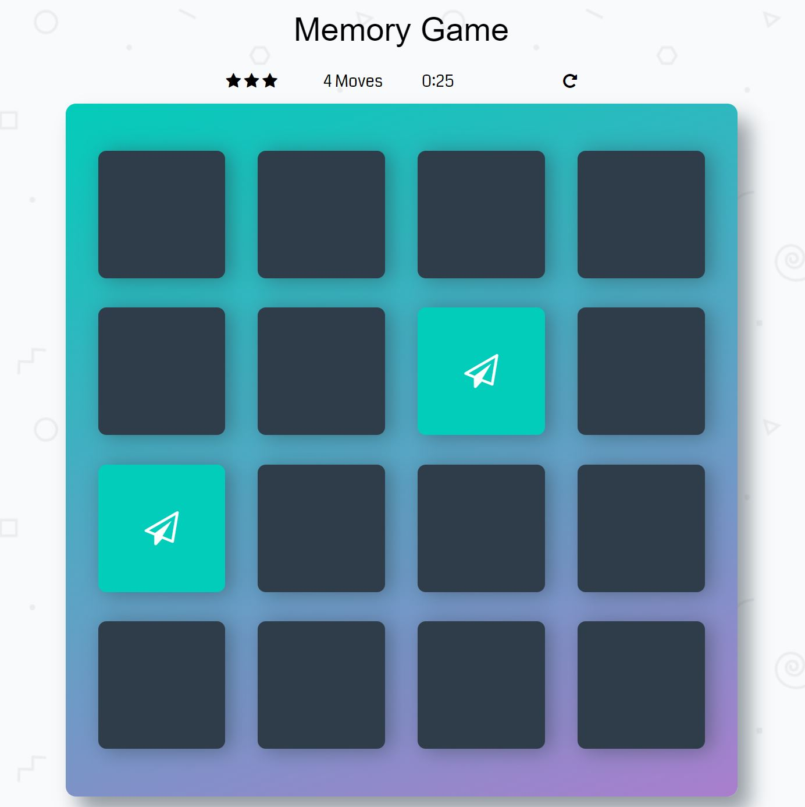
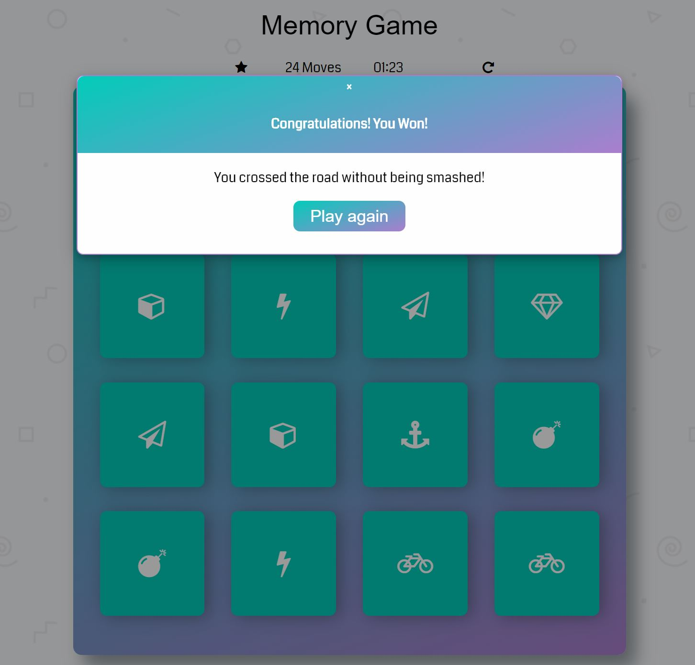

# Memory Game Project

This memory game is the second project for Udacity's Grow with Google Front-End Web Developer Nanodegree Course, which focuses on mastery of Javascript, HTML and CSS skills.

## How to Play the Game

To get started, click two of cards on the deck to flip them over and reveal images. If images on the cards match, cards will stay open. Otherwise, they will both flip over. The goal is to find all matches with the highest star rating possible.

The displayed star rating is 3 at the beginning. The rating decreases to 2 stars after 15 incorrect moves, and 1 star after 20 incorrect moves. Each move consists of flipping over any two cards.

A timer starts when the first card is clicked and stops when all matches are found.

When all eight matches are found, a pop up window will display the statistic of the game with the option to restart the game.

The game can be restarted at any time.

## Dependencies

- [BootStrap](https://getbootstrap.com/docs/4.0/getting-started/introduction/)
- [Font Awesome](https://fontawesome.com/)
- [Google Fonts](https://fonts.google.com/)
- [Animate CSS](https://daneden.github.io/animate.css/)
